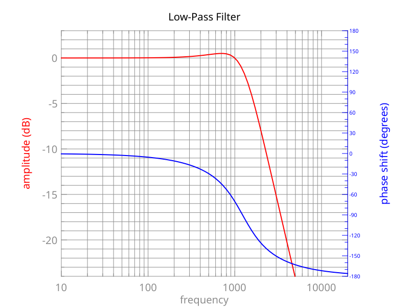
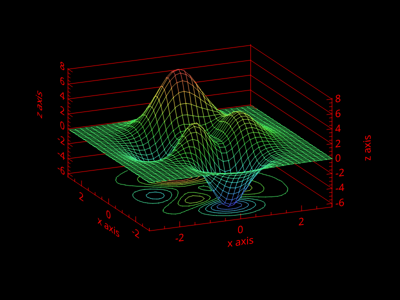
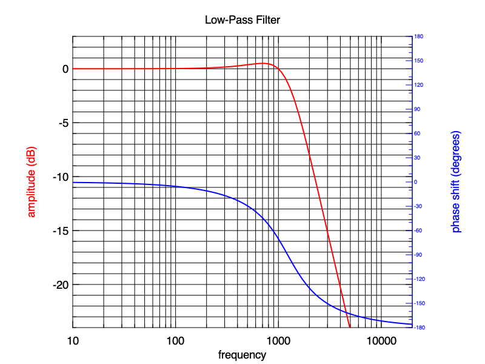
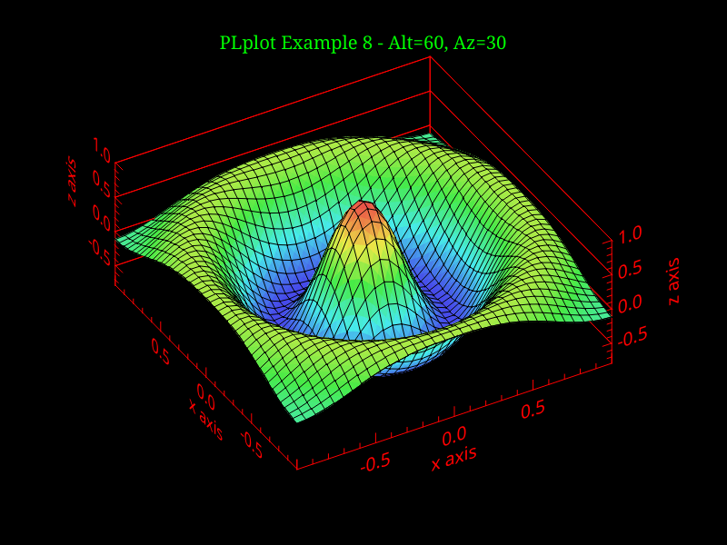
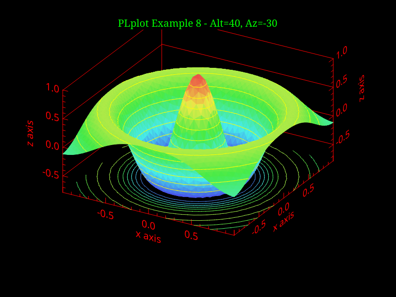

# Module PLplot for BLOC

The module "plplot" binds the PLplot API for BLOC. See the API reference from the PLplot main page.

## Loading the module

Like any other BLOC module, you have to load it with the statement `import`, before create objects from the type "plplot".

```
import plplot;
```

Once loaded, you can print the object interface.
```
help plplot
```

Below, I expose few samples to create 2D and 3D plot.
Prior the simplest.
```
import plplot;

p = plplot("xwin");
p.init("-geometry 800x600");
p.env(0,100,0,100);

x = tab(100,num());
y = tab(100,num());
for i in 0 to 99 loop
  x.put(i, i);
  y.put(i, pow(num(i)/10.0, 2));
end loop;

p.line(x,y);
p.flush();

dummy:string;
input(dummy, "Type RETURN to close ...");
p.close();
```
<p align="center">
  
<p>

Next a 3D mesh.
```
import plplot;

/* load tables of data */
XPTS = 35;
YPTS = 46;
X = tab(0, num());
Y = tab(0, num());
for I in 0 to (XPTS - 1) loop
    X.concat(((3.0 * (I - (XPTS / 2))) / (XPTS / 2)));
end loop;
for I in 0 to (YPTS - 1) loop
    Y.concat(((3.0 * (I - (YPTS / 2))) / (YPTS / 2)));
end loop;
Z = tab(0, tab(0, num()));
Z = tab(XPTS, tab(YPTS, num()));
for I in 0 to (XPTS - 1) loop
    XX = X.at(I);
    for J in 0 to (YPTS - 1) loop
        YY = Y.at(J);
        Z.at(I).put(J, (((((3.0 * (1.0 - XX)) * (1.0 - XX)) * exp((-(XX * XX) - ((YY + 1.0) * (YY + 1.0))))) - ((10.0 * (((XX / 5.0) - pow(XX, 3.0)) - pow(YY, 5.0))) * exp(((-XX * XX) - (YY * YY))))) - ((1.0 / 3.0) * exp(((-(XX + 1) * (XX + 1)) - (YY * YY))))));
    end loop;
end loop;

/* a function to initialize the colors map */
function cmap1_init(pl:plplot) return boolean is
begin
  /* initialize 4 tables of 2 decimals: Intensity, H, L, S */
  i = tab(2, num());
  i.put(0, 0.0); /* left boundaries */
  i.put(1, 1.0); /* right boundaries */
  /* H : blue - green - yellow - red */
  h = tab(2, num());
  h.put(0, 240.0);
  h.put(1, 0.0);
  /* L */
  l = tab(2, num());
  l.put(0, 0.6);
  l.put(1, 0.6);
  /* S */
  s = tab(2, num());
  s.put(0, 0.8);
  s.put(1, 0.8);

  pl.scmap1n( 256 );
  pl.scmap1l( false, i, h, l, s );
  return true;
end;

P = plplot("xwin");
P.init("-geometry 800x600");

/* find the minimum and maximum of Z matrix */
zmax = null;
zmin = null;
P.minmax2dgrid(Z, XPTS, YPTS, zmax, zmin);

/* create color levels */
NLEVEL = 10;
STEP = ((zmax - zmin) / (NLEVEL + 1));
CLEVEL = tab(0, num());
for I in 0 to (NLEVEL - 1) loop
    CLEVEL.concat(((zmin + STEP) + (STEP * I)));
end loop;

/* set cmap1 colors */
cmap1_init(P);

/* Draw ... */
P.adv(0);
P.col0(1);
P.vpor(0.0, 1.0, 0.0, 0.9);
P.wind(-1.0, 1.0, -1.0, 1.5);
P.w3d(1.0, 1.0, 1.2, -3.0, 3.0, -3.0, 3.0, zmin, zmax, 33.0, 24.0);
P.box3("bnstu", "x axis", 0.0, 0, "bnstu", "y axis", 0.0, 0, "bcdmnstuv", "z axis", 0.0, 4);
P.col0(2);

P.meshc(X, Y, Z, (1+2+4+8), CLEVEL);
P.flush();
P.pause(true);
```
<p align="center">
  
<p>

Next a 2D log.
```
import plplot;

/* create table for data */
freq = tab(0,num()); /* frequencies */
ampl = tab(0,num()); /* amplitudes */
phas = tab(0,num()); /* phases */

/* load tables data for log plot */
L = 1.2e-3; /* 1.2mH */
C = 14e-6;  /* 14uF */
R = 8;      /* 8R */

F = 10.0; /* first band */
while F < 10e5 loop
  ZC = 1 / ( 2 * pi * F * C * ii );
  ZL = 2 * pi * F * L * ii;

  Z0 = R * ZC / ( R + ZC );
  Z = ZL + ( R * ZC / ( R + ZC ) );

  freq.concat( log10(F) );
  ampl.concat( 20 * log10(imag(Z0/Z)));
  phas.concat( 180 * iphase(Z0/Z) / pi );

  F = F * 1.1; /* loop next band */
end loop;

/* create the object PLplot, using the driver xwin */
P = plplot("xwin");
/* P = plplot("png", "sample2d.png"); */

/* set background color white */
P.scolbga(255,255,255,1.0);
/* customize colors palette */
P.scol0a(15,0,0,0,1.0);
P.scol0a(7,140,140,140,1.0);

/* initialize the plotting */
P.init("-geometry 800x600");
P.adv(0);
P.col0( 15 );
P.vpor( 0.15, 0.85, 0.1, 0.9 );
P.wind( log10(10), log10(20000), -24.0, +3.0 );

/* put x-axis */
P.col0( 15 );
P.box( "bcfghlnst", 0.0, 0, "bcghnstv", 0.0, 0 );
P.mtex( "b", 3.2, 0.5, 0.5, "frequency" );

/* draw amplitude */
P.col0( 1 );
P.width( 2.0 );
P.line( freq, ampl );
P.width( 0 );
/* put label for amplitude */
p.mtex( "l", 5.0, 0.5, 0.5, "amplitude (dB)" );

/* draw phase */
P.col0( 9 );
P.schr(0, 0.5);
P.wind( log10(10), log10(20000), -180.0, 180.0 );
P.box( "", 0.0, 0, "cmstv", 30.0, 3 );
P.schr(0, 1.0);
P.width( 2.0 );
P.line( freq, phas );
P.width( 0 );
/* put label for phase */
P.mtex( "r", 5.0, 0.5, 0.5, "phase shift (degrees)" );

/* Put title */
P.col0( 15 );
P.width( 2.0 );
P.mtex( "t", 2.0, 0.5, 0.5, "Low-Pass Filter" );
P.width( 0 );

P.flush();
P.pause(true);
```
<p align="center">
  
<p>

Finally a 3D surf.
```
import plplot;

/* a function to initialize the colors map */
function cmap1_init(pl:plplot, gray:boolean) return boolean is
begin
  /* initialize 4 tables of 2 decimals: Intensity, H, L, S */
  i = tab(2, num());
  h = tab(2, num());
  l = tab(2, num());
  s = tab(2, num());

  i.put(0, 0.0); /* left boundaries */
  i.put(1, 1.0); /* right boundaries */

  if gray then
    /* H */
    h.put(0, 0.0);
    h.put(1, 0.0);
    /* L */
    l.put(0, 0.5);
    l.put(1, 1.0);
    /* S */
    s.put(0, 0.0);
    s.put(1, 0.0);
  else
    /* H: blue - green - yellow - red */
    h.put(0, 240.0);
    h.put(1, 0.0);
    /* L */
    l.put(0, 0.6);
    l.put(1, 0.6);
    /* S */
    s.put(0, 0.8);
    s.put(1, 0.8);
  end if;

  pl.scmap1n( 256 );
  pl.scmap1l( false, i, h, l, s );
  return true;
end;

/* a function to draw the plot */
function draw( k:integer , ifshade:integer ) return plplot is
begin
  $XPTS = 35;
  $YPTS = 45;

  alt = tab(2, num());
  alt.put(0, 60.0);
  alt.put(1, 40.0);
  az = tab(2, num());
  az.put(0, 30.0);
  az.put(1, -30.0);

  title = tab(2, str());
  title.put(0, "#frPLplot Example 8 - Alt=60, Az=30");
  title.put(1, "#frPLplot Example 8 - Alt=40, Az=-30");

  $LEVELS = 10;
  x = tab($XPTS, num());
  y = tab($YPTS, num());
  z = tab($XPTS, tab($YPTS, num()));
  dx = 2.0 / ( $XPTS - 1 );
  dy = 2.0 / ( $YPTS - 1 );
  zmin = num();
  zmax = num();
  STEP = num();
  clevel = tab($LEVELS, num());
  nlevel = $LEVELS;

  indexxmin = 0;
  indexxmax = $XPTS;

  x0 = 0.5 * ( $XPTS - 1 );
  a  = 0.9 * x0;
  y0 = 0.5 * ( $YPTS - 1 );
  b  = 0.7 * y0;

  plot = plplot("xwin");
  plot.init("-geometry 800x600");

  z_row_major = tab($XPTS * $YPTS, num());
  z_col_major = tab($XPTS * $YPTS, num());

  for i in 0 to $XPTS-1 loop
    x.put(i, -1.0 + i * dx );
  end loop;

  for j in 0 to $YPTS-1 loop
    y.put(j, -1.0 + j * dy );
  end loop;

  for i in 0 to $XPTS-1 loop
    xx = x.at(i);
    for j in 0 to $YPTS-1 loop
      yy = y.at(j);
      r = sqrt( xx * xx + yy * yy );
      z.at(i).put(j, exp( -r * r ) * cos( 2.0 * pi * r ));

      z_row_major.put(i * $YPTS + j, z.at(i).at(j));
      z_col_major.put(i + $XPTS * j, z.at(i).at(j));
    end loop;
  end loop;

  /* Allocate and calculate y index ranges and corresponding zlimited */
  zlimited = tab($XPTS, tab($YPTS, 0.0));
  indexymin = tab($XPTS, int());
  indexymax = tab($XPTS, int());

  for i in indexxmin to indexxmax-1 loop
    square_root = sqrt( 1.0 - min( 1.0, pow( ( i - x0 ) / a, 2.0 ) ) );
    indexymin.put(i, max( 0, ( 0.5 + y0 - b * square_root )));
    indexymax.put(i, min( $YPTS, 1 + ( 0.5 + y0 + b * square_root )));

    for j in indexymin.at(i) to indexymax.at(i)-1 loop
      zlimited.at(i).put(j, z.at(i).at(j));
    end loop;
  end loop;

  plot.minmax2dgrid( z, $XPTS, $YPTS, zmax, zmin );
  STEP = ( zmax - zmin ) / ( nlevel + 1 );

  for i in 0 to nlevel-1 loop
    clevel.put(i, zmin + STEP + STEP * i);
  end loop;

  plot.lightsource( 1.0, 1.0, 1.0 );

  plot.adv( 0 );
  plot.vpor( 0.0, 1.0, 0.0, 0.9 );
  plot.wind( -1.0, 1.0, -0.9, 1.1 );
  plot.col0( 3 );
  plot.mtex( "t", 1.0, 0.5, 0.5, title.at(k) );
  plot.col0( 1 );
  plot.w3d( 1.0, 1.0, 1.0, -1.0, 1.0, -1.0, 1.0, zmin, zmax, alt.at(k), az.at(k) );

  plot.box3( "bnstu", "x axis", 0.0, 0,
            "bnstu", "y axis", 0.0, 0,
            "bcdmnstuv", "z axis", 0.0, 0 );
  plot.col0( 2 );

  if ifshade == 0 then /* diffuse light surface plot */
    cmap1_init( plot, true );
    plot.surf3d( x, y, z, 0, tab(0, num()) );
  elsif ifshade == 1 then /* magnitude colored plot */
    cmap1_init( plot, false );
    plot.surf3d( x, y, z, 4, tab(0, num()) );
  elsif ifshade == 2 then /* magnitude colored plot with faceted squares */
    cmap1_init( plot, false );
    plot.surf3d( x, y, z, 4+128, tab(0, num()) );
  elsif ifshade == 3 then /* magnitude colored plot with contours */
    cmap1_init( plot, false );
    plot.surf3d( x, y, z, 4+32+8, clevel );
  else /* magnitude colored plot with contours and index limits */
    cmap1_init( plot, false );
    plot.surf3dl( x, y, zlimited, 4+32+8, clevel, indexxmin, indexxmax, indexymin, indexymax );
  end if;

  plot.flush();
  return plot;
end;

/* user input for view type, and shading type */
$var = str();
input($var, "View\t? (0 or 1) ");
if isnum($var) then k = int($var); else k = 0; end if;
if k < 0 or k > 1 then k = 0; end if;

input($var, "Shading\t? (0,1,2,3 or 4) ");
if isnum($var) then ifshade = int($var); else ifshade = 0; end if;
if ifshade < 0 or ifshade > 4 then ifshade = 0; end if;

p = draw( k, ifshade );
p.pause(true);
```
<p align="center">
  
  
<p>
