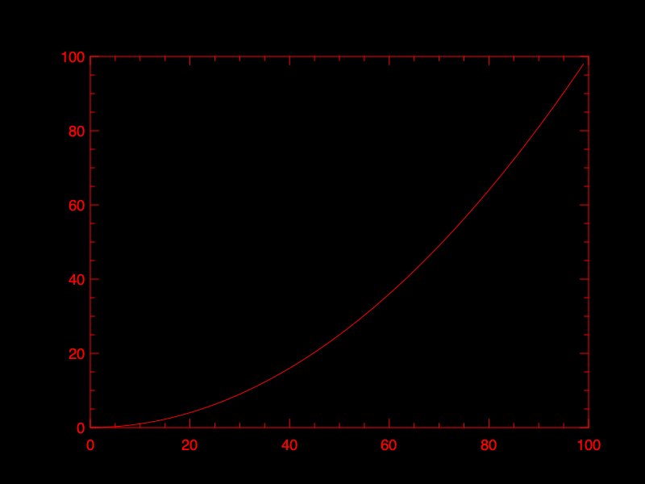

# Module PLplot for BLOC

The module "plplot" binds the PLplot API for BLOC. See the reference API from the PLplot main page.

## Loading the module

Like any other BLOC module, you have to load it with the statement `import`, before create objects from the type "plplot".

```
import plplot;
```

Once loaded, you can print the object interface.
```
help plplot
```

Below, I expose a sample to create a plot.
```
/* import the module plplot */
import plplot;

/* create table for data */
freq = tab(0,num()); /* frequencies */
ampl = tab(0,num()); /* amplitudes */
phas = tab(0,num()); /* phases */

/* load tables data for log plot */
L = 1.2e-3; /* 1.2mH */
C = 14e-6;  /* 14uF */
R = 8;      /* 8R */

F = 10.0; /* first band */
while F < 10e5 loop
  ZC = 1 / ( 2 * pi * F * C * ii );
  ZL = 2 * pi * F * L * ii;

  Z0 = R * ZC / ( R + ZC );
  Z = ZL + ( R * ZC / ( R + ZC ) );

  freq.concat( log10(F) );
  ampl.concat( 20 * log10(imag(Z0/Z)));
  phas.concat( 180 * iphase(Z0/Z) / pi );

  F = F * 1.1; /* loop next band */
end loop;

/* create the object PLplot, using the driver xwin */
P = plplot("xwin");
/* or use file driver output */
/* P = plplot("png", "/tmp/myplot.png"); */

/***************************************************/
/* see API reference from the PLplot documentation */
/***************************************************/

/* set background color white */
P.colbga(255,255,255,1.0);
/* customize colors palette */
P.col0a(15,0,0,0,1.0);
P.col0a(7,140,140,140,1.0);

/* initialize the plotting */
P.init("-geometry 800x600"); /* initialize the plot with the given geometry */
P.adv(0);
P.col0( 7 );
P.vpor( 0.15, 0.85, 0.1, 0.9 );
P.wind( log10(10), log10(20000), -24.0, +3.0 );

/* put x-axis */
P.col0( 7 );
P.box( "bcfghlnst", 0.0, 0, "bcghnstv", 0.0, 0 );
P.mtex( "b", 3.2, 0.5, 0.5, "frequency" );

/* draw amplitude */
P.col0( 1 );
P.width( 2.0 );
P.line( freq, ampl );
P.width( 0 );
/* put label for amplitude */
p.mtex( "l", 5.0, 0.5, 0.5, "amplitude (dB)" );

/* draw phase */
P.col0( 9 );
P.chr(0, 0.5);
P.wind( log10(10), log10(20000), -180.0, 180.0 );
P.box( "", 0.0, 0, "cmstv", 30.0, 3 );
P.chr(0, 1.0);
P.width( 2.0 );
P.line( freq, phas );
P.width( 0 );
/* put label for phase */
P.mtex( "r", 5.0, 0.5, 0.5, "phase shift (degrees)" );

/* Put title */
P.col0( 15 );
P.width( 2.0 );
P.mtex( "t", 2.0, 0.5, 0.5, "Low-Pass Filter" );
P.width( 0 );

/* enabling pause: the plotting frame must be manually closed to unlock */ 
P.pause(true);
/* or close to flush file output */
/* P.close(); */
```

<p align="center">
  
<p>

